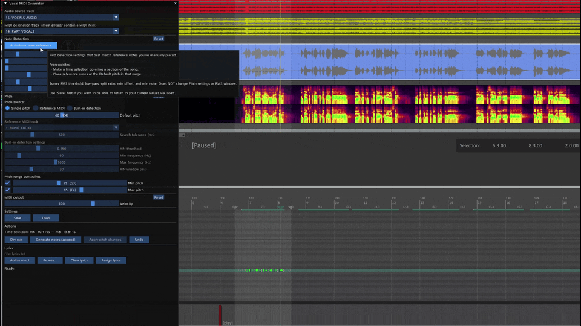
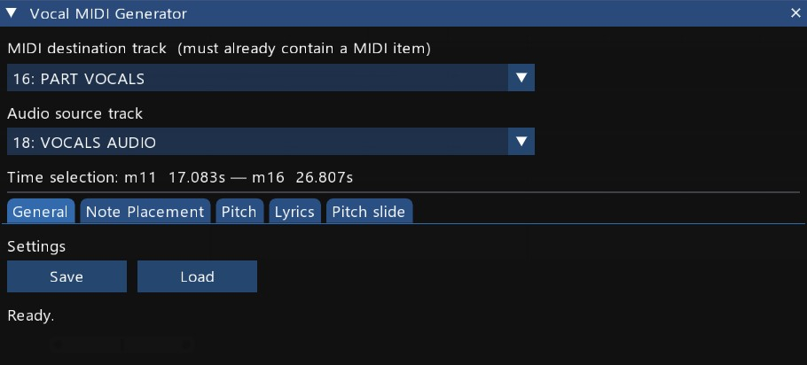
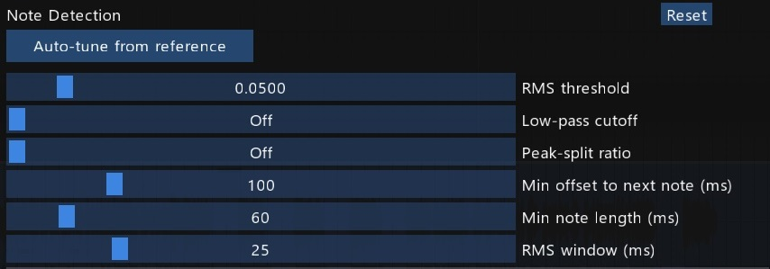
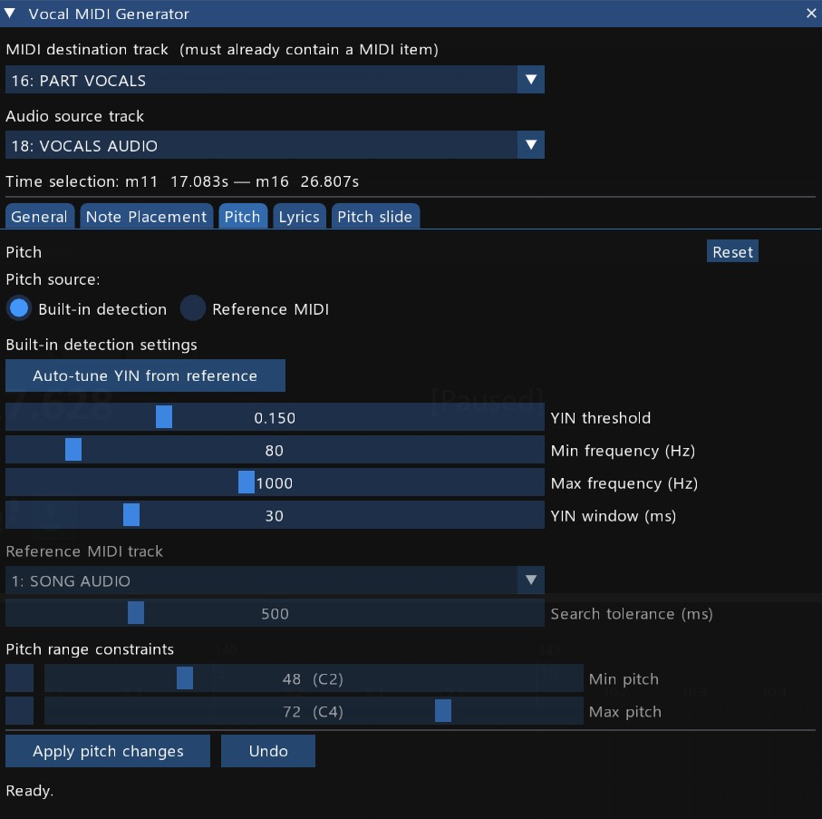
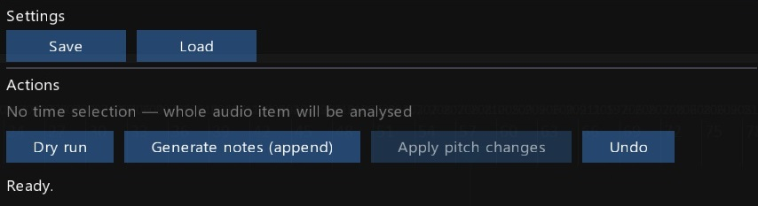
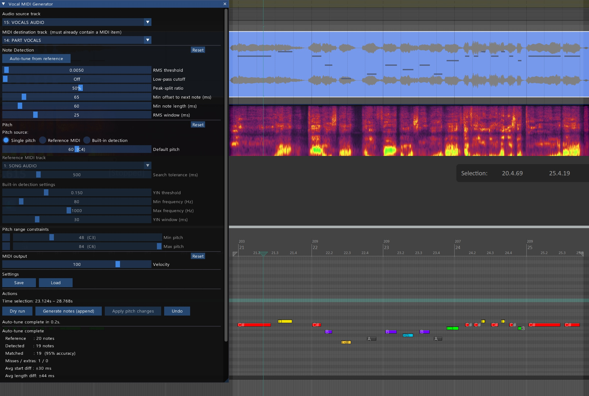
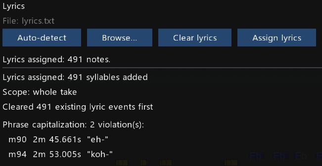

# Vocal MIDI Generator

**Generate timing-aligned MIDI notes from a vocal stem, with lyric assignment built in.** A REAPER ReaScript that analyses a vocal audio track and generates MIDI notes aligned to the syllables and phrases it detects, then assigns lyrics to those notes.

Designed for authoring Rock Band-style vocal charts — it defaults to the RB3 vocal pitch range (C1–C5) and the standard phrase-marker convention (pitch 105) — but the timing detection and lyric assignment work for any rhythm/karaoke MIDI workflow.

<!-- TODO: replace with a 10–15 s GIF showing dry run → generate → assign lyrics -->



---

## Requirements

- [REAPER](https://www.reaper.fm/) **6.x or later**
- [ReaImGui](https://forum.cockos.com/showthread.php?t=250419) **0.7 or later** (August 2022) — install via **Extensions → ReaPack → Browse packages**, search for `ReaImGui`

The script checks both on startup: if ReaImGui is missing it shows an install prompt; if it is too old (pre-0.7, which lacks `ImGui_BeginDisabled`) it shows an update prompt.

---

## Installation

1. Download `vocal_midi_generator_vkr.lua` and place it anywhere REAPER can find scripts (e.g. your REAPER Scripts folder).
2. In REAPER: **Actions → Show action list → Load ReaScript** and select the file.
3. Optionally assign the action to a toolbar button or keyboard shortcut.

---

## Quick start

1. Open a REAPER project containing a vocal stem on one track and a destination track with a MIDI item on it.
2. Run the script. The window opens and attempts to auto-select the right tracks (it looks for tracks named `VOCALS AUDIO` / `DRYVOX1` for audio and `PART VOCALS` for MIDI destination).
3. Confirm the track selections in the dropdowns if needed.
4. Click **Dry run** to see how many notes would be detected with the current settings.
5. Click **Generate notes (append)** to write the notes into your MIDI item.

---

## UI overview



The window is divided into five main sections:

| Section         | Purpose                                                                      |
| --------------- | ---------------------------------------------------------------------------- |
| Track selection | Choose audio source, MIDI destination, and (optionally) reference MIDI track |
| Note Detection  | Sliders that control when and how syllables are detected                     |
| Pitch source    | Choose how MIDI pitch is assigned to each detected note                      |
| MIDI output     | Velocity slider, action buttons, result panel                                |
| Lyrics          | Select a lyrics file and assign words to the generated notes                 |

---

## Workflow

### Step 1 — Set up your tracks

You need two tracks before running the script:

- **Audio source track** — contains the vocal stem (an isolated vocals-only audio file, e.g. from an AI stem separator like Demucs or UVR).
- **MIDI destination track** — contains a MIDI item that spans the region you want to work on. The script writes into this existing item; it will not create a new one.

If you plan to use **Reference MIDI** as the pitch source, add a third track containing the reference notes.

### Step 2 — (Optional) Make a time selection

If you only want to process part of the song, make a time selection in REAPER before running any action. The script respects the time selection for all operations: detection, auto-tune, apply pitch changes, and lyric assignment.

Without a time selection, the full audio item is analysed.

### Step 3 — Tune the Detection settings



The Detection sliders control the audio energy analysis. Start with defaults and adjust based on what Dry run reports.

| Slider                      | Range                 | Default | What to adjust                                                                                                         |
| --------------------------- | --------------------- | ------- | ---------------------------------------------------------------------------------------------------------------------- |
| **RMS threshold**           | 0.001 – 0.5           | 0.05    | Lower if quiet phrases are missed; raise if noise/breath triggers too many notes.                                      |
| **Low-pass cutoff**         | 0 – 8000 Hz (0 = off) | Off     | Set to ~1500–2500 Hz to make sibilants (S, F, SH) invisible to the detector, so note starts snap to the vowel.         |
| **Peak-split ratio**        | 0 – 95% (0 = off)     | Off     | When phrases contain multiple syllables without dropping to silence, this splits them. Start around 40–60% and adjust. |
| **Min offset to next note** | 0 – 500 ms            | 100 ms  | Enforces a minimum gap between notes by trimming end times. Prevents notes from running into each other.               |
| **Min note length**         | 10 – 500 ms           | 60 ms   | Discards very short detections (breath noise, consonants). Raise to filter out more.                                   |
| **RMS window**              | 5 – 100 ms            | 25 ms   | Time resolution of the analysis. Smaller = more precise timing but slower. Rarely needs changing.                      |

> **Tip:** All sliders support Ctrl+click to type an exact value.

### Step 4 — Choose a Pitch source



Select how MIDI pitch is assigned to each detected note:

#### Single pitch

Every note is assigned the same pitch (the **Default pitch** slider). Use this when pitch doesn't matter yet — you just want timing data — or when your game engine uses a single note row for vocals.

#### Reference MIDI

Pitch is taken from an existing MIDI track. For each detected note, the script finds the nearest MIDI note on the reference track (within the **Search tolerance** window) and uses that pitch. Falls back to Default pitch when nothing is within range.

This works well with MIDI output from AI pitch tools like [Basic Pitch](https://basicpitch.spotify.com/). Import the AI MIDI output onto the reference track, then use this mode to transfer those pitches onto your timing-detected notes.

#### Built-in detection (YIN)

The script analyses the audio directly using the [YIN algorithm](http://audition.ens.fr/adc/pdf/2002_JASA_YIN.pdf) to estimate the fundamental frequency of each note. No external MIDI reference needed.

| Slider            | Range         | Default | Notes                                                                                                                   |
| ----------------- | ------------- | ------- | ----------------------------------------------------------------------------------------------------------------------- |
| **YIN threshold** | 0.01 – 0.5    | 0.15    | Confidence cutoff. Lower = stricter (more fallbacks to Default pitch). Higher = more detections but more octave errors. |
| **Min frequency** | 40 – 400 Hz   | 80 Hz   | Set to just below the lowest note in the vocal.                                                                         |
| **Max frequency** | 200 – 2000 Hz | 1000 Hz | Set to just above the highest note.                                                                                     |
| **YIN window**    | 10 – 100 ms   | 30 ms   | Audio length analysed per note. Longer is more stable but may miss very short notes.                                    |

The algorithm samples audio starting at 30% into each note (to avoid the attack transient and land on the steady-state vowel). Notes where no confident pitch is found fall back to Default pitch.

#### Pitch range constraints (min / max)

Two optional checkbox+slider pairs clamp or octave-shift pitches into a target range. When a detected pitch is outside the range, the script first tries octave-shifting it back in (±12 semitones, up to 16 attempts), then falls back to clamping. Useful for correcting octave errors from AI stem separation.

> **Example:** Max pitch set to 72 (C5). A detected pitch of 84 (C6) is shifted down one octave to 72 — within range, accepted. A detected pitch of 86 with Min = 60 and Max = 72 has no octave that fits inside a 12-semitone window, so it clamps to the nearer endpoint (72).

### Step 5 — Dry run and Generate



- **Dry run** — runs the full detection and pitch assignment pipeline but does not write anything to REAPER. Reports how many notes were found, how many pitches were matched or fell back to default, etc.
- **Generate notes (append)** — writes notes into the destination MIDI item. Before inserting, it clears any existing notes at the pitches it is about to write (within the analysis range), so re-running is safe and does not stack duplicates.

The result panel below the buttons shows counts for the last action.

---

## Auto-tune from reference



Auto-tune automates the process of finding Detection slider values that reproduce a set of manually-placed timing reference notes.

**How to use it:**

1. Manually place a handful of MIDI notes on the destination track at the Default pitch. These represent the "correct" timing you want the detector to match.
2. Make a time selection covering those reference notes.
3. Click **Auto-tune from reference**.

The script runs a coordinate descent search over five detection parameters (**RMS threshold**, **Low-pass cutoff**, **Peak-split ratio**, **Min offset**, **Min note length**) and leaves the rest alone. When it finishes, the sliders update to the best-found values and the result panel shows accuracy statistics.

**What auto-tune changes:** the five detection sliders listed above.
**What it leaves alone:** RMS window (a resolution choice, not a fit-to-reference parameter), all pitch settings, velocity, and your reference notes themselves.

> **Note:** Auto-tune can take several seconds for longer sections. The UI will be unresponsive during the search — this is expected (see [Known limitations](#known-limitations)).

---

## Apply pitch changes

**Apply pitch changes** reassigns the pitches of existing notes on the destination track without altering their position or length. Use this when:

- You've manually adjusted note timing and now want to add pitch information.
- You want to re-pitch notes after changing the Pitch source settings without re-running detection.

The button is disabled when Pitch source is set to Single pitch (it would just overwrite every note with the same pitch, which is not useful).

---

## Lyrics



The Lyrics section assigns words from a plain-text file to the MIDI notes on the destination track as lyric text events (the same format REAPER's native lyric tools use).

> **Note on RB3 conventions:** Lyric assignment operates on notes within the RB3 vocal range (C1–C5, MIDI pitches 36–84), and the phrase capitalization check uses pitch 105 as the phrase-boundary marker. These are Rock Band 3 standards; if you author for a different game with a different convention, the script's behaviour here may need adjusting.

### Lyrics file format

A plain `.txt` file — one word (syllable) per entry, separated by any whitespace (spaces, tabs, or newlines). Anything inside `[square brackets]` is stripped before splitting, so section headers like `[chorus]` are ignored.

```
And I
[verse]
would walk five hun- dred miles
```

### Selecting a file

- **Auto-detect** — looks for `lyrics.txt` in the project folder and selects it automatically. Runs on script open and when you switch REAPER project tabs.
- **Browse...** — opens a file picker starting in the project folder. Only `.txt` files are accepted.

The selected filename is shown above the buttons. The path is remembered for the duration of the session but is not saved to the project file.

### Assigning lyrics

All four buttons sit on one row:

| Button            | What it does                                                                     |
| ----------------- | -------------------------------------------------------------------------------- |
| **Auto-detect**   | Find `lyrics.txt` in the project folder                                          |
| **Browse...**     | Pick any `.txt` file                                                             |
| **Clear lyrics**  | Remove all lyric events from the whole MIDI take (preserves special game events) |
| **Assign lyrics** | Clear first, then assign one word per note in start-time order                   |

**Assign lyrics** scope:

- With a time selection — only notes within the selection receive lyrics.
- Without a time selection — all notes in the RB3 vocal range (C1–C5) on the take are used.

Special game events (`[tambourine_start]`, `[cowbell_start]`, etc.) are always preserved by both Clear and Assign.

### Result panel

After **Assign lyrics** the result panel shows:

- How many syllables were added and what range was used.
- A **count mismatch warning** if the number of notes and lyrics words differ — e.g. _"48 notes, 45 lyrics — last 3 notes have no lyric"_.
- A **phrase capitalization check**: for each phrase marker note (pitch 105) the script finds the first vocal note that follows it and checks that its assigned lyric starts with an uppercase letter. Violations are listed with their measure number and timestamp so you can jump straight to the problem:

  ```
  Phrase capitalization: 2 violation(s):
    m32  1m 04.250s  "and"
    m67  2m 14.120s  "it"
  ```

  If no phrase marker notes are present the check reports that it cannot validate.

> **Tip:** Place phrase markers on your destination MIDI track before running Assign lyrics. The script reads them but never modifies them, so they are safe to have in place throughout the whole authoring process.

---

## Undo

The **Undo** button directly calls REAPER's undo. It exists because the ImGui window captures keyboard focus, so REAPER's own Ctrl+Z shortcut does not fire while the script window is active. The button is disabled when there is nothing to undo, and the tooltip shows the label of the operation that will be undone.

---

## Save and Load

Settings are saved per-project using REAPER's project state. Click **Save** to store the current Detection and Pitch settings. Click **Load** to restore them.

Settings are loaded automatically when the script opens (if a save exists for the current project) and when you switch REAPER project tabs.

**What is saved:** all Detection sliders, Pitch source selection and all pitch settings (including YIN parameters), Velocity.

**What is not saved:** track selections. If your project follows the naming convention (`VOCALS AUDIO`, `PART VOCALS`) the script will re-select the right tracks automatically.

---

## Tips

- **Start with Single pitch mode** to get the timing right first, then switch to a pitch source and use Apply pitch changes to add pitch data without re-running detection.
- **Use a time selection to work section by section.** Chorus and verse may need different threshold settings. Generate into the same MIDI item repeatedly; each run only touches notes at the pitches it produces.
- **Low-pass cutoff makes a big difference** for sibilant-heavy vocals. If note starts consistently land on the consonant instead of the vowel, enable the low-pass filter around 1500–2000 Hz.
- **Reference MIDI mode + Basic Pitch** is a good combination: Basic Pitch provides reasonable pitch estimates that you can refine with the pitch range constraints, while the script provides tighter timing than Basic Pitch alone.
- **Auto-tune works best with 10–30 representative reference notes** covering the range of dynamics in the section.
- **Finish timing and pitch before assigning lyrics.** Assign lyrics runs on notes as they are at the moment you click — if you later split, merge, or reorder notes, re-run Assign lyrics to realign the words. The whole-take clear-and-reassign approach keeps this safe and idempotent.
- **Name your lyrics file `lyrics.txt` and save it in the project folder.** Auto-detect will find it every time you open the script or switch project tabs, saving you the Browse step entirely.

---

## Troubleshooting

If something is going wrong, find the symptom below and try the suggested fixes.

### Detection

**Note starts land on consonants instead of vowels.**
Enable the **Low-pass cutoff** at around 1500–2000 Hz. Sibilants (S, F, SH) carry significant energy at high frequencies, which can trigger detection slightly before the vowel begins. Filtering them out makes the detector "see" the vowel onset.

**Quiet phrases are being missed entirely.**
Lower the **RMS threshold** (try 0.02 or 0.01). If only specific phrases are quiet relative to the rest of the section, work that section separately with a time selection.

**Too many false notes — breath noise, consonants, room tone trigger detections.**
Raise the **RMS threshold**, raise **Min note length** to 80–120 ms, or both. Breath noise is usually short and low-energy; either of these filters should remove most of it.

**Fast syllables are being merged into one long note.**
Enable **Peak-split ratio**. Start at 40–50% and adjust. The split happens wherever the contour drops below `peak × ratio` within a phrase.

**Notes are running into each other with no gap between them.**
Raise **Min offset to next note**. The default of 100 ms is conservative; values up to 200–250 ms work well for slower vocals.

**Auto-tune produces strange results.**
Auto-tune fits to whatever timing reference notes you give it — if those notes are inaccurate or unrepresentative, the result will be too. Use 10–30 reference notes that cover the dynamic range of the section, and place them carefully.

### Pitch

**YIN reports lots of octave errors.**
Tighten the **Min frequency** and **Max frequency** range to bracket the actual vocal range as closely as possible. As a fallback, enable the **Pitch range constraints** (min/max) — the script will octave-shift out-of-range pitches back in.

**YIN falls back to Default pitch on most notes.**
Raise the **YIN threshold** (try 0.2 or 0.25). The threshold is a confidence cutoff — too strict and the algorithm rejects valid detections.

**Reference MIDI mode reports zero matches.**
Check that the reference MIDI item actually overlaps the analysis range, and that the **Search tolerance** is wide enough (try 200–500 ms). If your reference is consistently early or late versus the audio, nudge the MIDI item in REAPER to align it.

### Lyrics

**Lyrics file isn't auto-detected.**
The auto-detect looks for a file literally named `lyrics.txt` in the project folder. Check the filename (extension included) and the folder, or use **Browse...** to pick the file manually.

**Count mismatch warning: more notes than lyrics.**
The lyrics file has fewer syllables than there are notes in scope. Common causes: a multi-syllable word that should be split with hyphens (`won-` `der-` `ful` instead of `wonderful`), or an extra note that shouldn't be there.

**Count mismatch warning: more lyrics than notes.**
The opposite — usually a missed detection (try a lower RMS threshold) or two syllables incorrectly merged into one note (try peak-split).

**Phrase capitalization check reports violations.**
A phrase marker note (pitch 105) is followed by a lyric that starts with a lowercase letter. Either capitalize the lyric in your file or move the phrase marker — the result panel gives you the measure number and timestamp so you can navigate directly.

---

## Known limitations

These are intentional trade-offs or REAPER API constraints, not bugs. Documented here so you know what to expect.

1. **Auto-tune freezes the UI during the parameter search.** Single-threaded Lua, and REAPER's audio accessor APIs (`GetAudioAccessorSamples`, `new_array`) do not work reliably from a Lua coroutine — they return nil. A coroutine-based progress bar was attempted and reverted for this reason. Typical 20–40 second sections finish in a few seconds; full songs can take noticeably longer.

2. **Apply pitch changes matches by note-start time only.** If you have manually shifted notes around significantly, a moved note will pull the pitch of whatever reference note is closest in time, which may not be the one you intended. Re-run timing detection if matching breaks down.

3. **Peak-split uses the global per-phrase peak.** A phrase with one loud syllable (RMS 0.8) and one quiet one (RMS 0.3) at split ratio 50% will lose the quiet syllable, because the cut threshold (0.4) is above it. In practice vocals usually stay within ~2× dynamic range within a phrase, but uneven sections may need a lower split ratio or a manual fix.

4. **Single audio item per audio track.** Without a time selection, only the first item on the audio track is analyzed. With a time selection, the script picks the item that overlaps. If your stem is split across multiple items, glue them first.

5. **Reference MIDI alignment is the user's responsibility.** There is no automatic cross-correlation between detected onsets and reference onsets. If Basic Pitch's output is consistently early or late, nudge the MIDI item in REAPER or widen the Search tolerance.

6. **Track selections are not persisted across sessions.** Track indices are positional and would be brittle to save. Smart defaults (matching `VOCALS AUDIO` / `PART VOCALS` track names) cover the common case; otherwise re-pick on each open.

7. **YIN samples a fixed window at 30% into the note.** Works well for sustained vowels but may land on a consonant for very fast syllables. The 30% offset is a heuristic that avoids the attack transient while staying inside the note.

---

## License

MIT — see [LICENSE](LICENSE).
